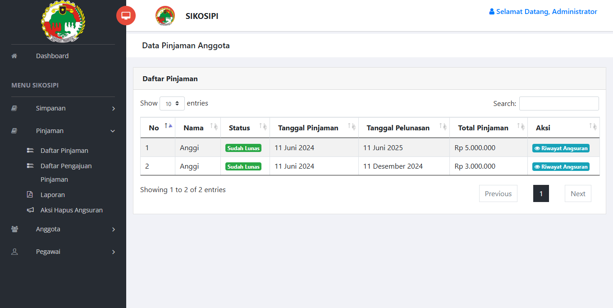

# 🏦 Sistem Informasi Koperasi Simpan Pinjam

Sistem Informasi ini dibangun menggunakan **CodeIgniter 3** (CI3) dan ditujukan untuk membantu pengelolaan simpan pinjam anggota koperasi 
secara efisien dan terstruktur. Sistem ini mendukung fitur-fitur inti seperti 
manajemen simpanan, pinjaman, anggota, pegawai, dan tampilan dashboard yang informatif.

## 📌 Spesifikasi Proyek

| 💻 Komponen         | 🛠️ Teknologi                                                                 |
|---------------------|------------------------------------------------------------------------------|
| ⚙️ Framework        |  CodeIgniter 3 |
| 🧠 Bahasa Pemrograman |  PHP v8.1                      |
| 🛢️ Database         |  MariaDB |
| 🌠Web Server       |  Apache (via XAMPP) |
| 🧮 Basis Data       |  RDBMS                        |

---

## 📊 Menu Utama

### 1. 📍 Dashboard
Menampilkan ringkasan data simpanan, pinjaman, anggota aktif, dan notifikasi.

---

### 2. 💰 Simpanan
- Entri dan manajemen data simpanan anggota (pokok dan wajib)
- Riwayat dan laporan simpanan per anggota
- Permintaan hapus setoran anggota yang terlanjur terentri.
- Penarikan simpanan anggota.

---

### 3. 💳 Pinjaman
- Daftra Pinjaman
- Pengajuan dan verifikasi pinjaman
- Status dan histori pembayaran pinjaman
- Laporan

---

### 4. 👥 Anggota
- Manajemen data anggota koperasi
- Aktivasi/deaktivasi status anggota
- Pencarian dan filter anggota

---

### 5. 👤 Pegawai
- Manajemen akun pegawai (admin/operator)
- Hak akses dan aktivitas pegawai

---

## 🚀 Cara Menjalankan Aplikasi

1. Clone repositori ini atau salin ke direktori `htdocs` di XAMPP:
   git clone https://github.com/username/sikosipi.git
   
2. Buat database baru di phpMyAdmin dan impor file SQL (jika tersedia) di folder database/.

3. Atur konfigurasi database di application/config/database.php:
	'hostname' => 'localhost',
	'username' => 'root',
	'password' => '',
	'database' => 'sikosipi',
	
4. Jalankan melalui browser:
	http://localhost/sikosipi/
	

🧑‍💻 Kontribusi
Pull request dan saran pengembangan sangat disambut! Jangan ragu untuk fork dan modifikasi proyek ini.

📃 Lisensi
Proyek ini bersifat open-source dan dapat digunakan untuk pembelajaran atau pengembangan lebih lanjut. 
Silakan cantumkan kredit kepada pengembang asli bila digunakan secara publik.

🙋‍♂️ Kontak Pengembang
📧 Email: [yudyasukma2@gmail.com]

